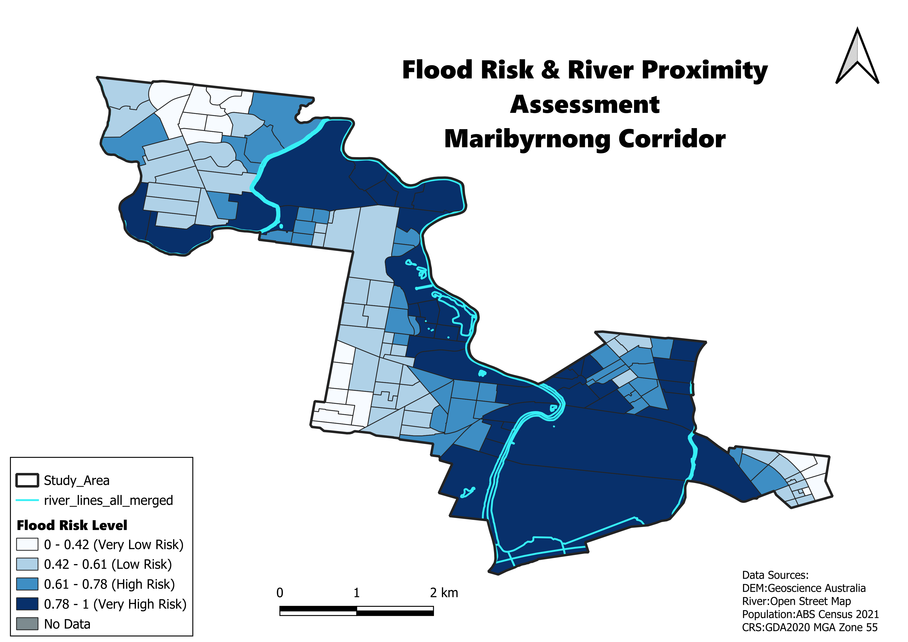

# Flood Risk & Low-Lying Area Mapping — Maribyrnong River Corridor

## Overview
This project maps composite flood risk across the Maribyrnong River corridor in Melbourne, Australia, combining elevation (DEM) and proximity to the river to identify populations most exposed to flooding. Unlike Projects 1-3 (Mornington Peninsula), this project uses a different study area — the Maribyrnong River corridor — chosen because it has a well-documented flood history and official flood mapping (Melbourne Water's LSIO) available for validation.

**Study area:** Kensington, Footscray, West Melbourne, Maribyrnong, and Avondale Heights (inner-west Melbourne, along the Maribyrnong River).

## Data Sources
- **Digital Elevation Model (DEM):** 5m resolution, Geoscience Australia, via elevation.fsdf.org.au (GDA2020 / MGA Zone 55)
- **River network:** OpenStreetMap (`waterway=river`, `natural=water`), extracted via QuickOSM
- **Population data:** Australian Bureau of Statistics, 2021 Census (G01 — Selected Person Characteristics by SA1), total persons (`Tot_P_P`)
- **Statistical boundaries:** ABS SA1 (Statistical Area Level 1), 2021 edition
- **Validation reference:** Melbourne Water / Victorian Government LSIO (Land Subject to Inundation Overlay), viewed via VicPlan

## Methodology
1. Clipped the DEM and SA1 boundaries to the study area (EPSG:7855 — GDA2020 / MGA Zone 55).
2. Extracted the river network from OpenStreetMap, merged line and polygon water features, and rasterised it to match the DEM's resolution and extent.
3. Generated a **distance-to-river raster** using the Proximity (Raster Distance) tool.
4. Calculated **zonal statistics (mean)** per SA1 for both elevation and distance-to-river.
5. Normalised both variables (0-1 scale), with lower elevation and closer river proximity mapped to higher risk.
6. Combined them into a composite **Risk Score**:

   ```
   Risk_score = 0.5 × norm_elevation + 0.5 × norm_river_distance
   ```

7. Classified the score into 4 classes (Natural Breaks / Jenks): 0-0.42, 0.42-0.61, 0.61-0.78, 0.78-1.
8. Joined 2021 Census population data to each SA1 and calculated the population share within each risk class.

**Note:** 9 of 196 SA1s (4.6%) returned a NULL risk score due to gaps in DEM coverage over open space/parkland near the river (e.g. Fairbairn Park, Riverside Golf/Tennis/Netball Centre) and were excluded from the population calculations below.

## Interactive Web Map
Explore the results on an interactive ArcGIS Online map. Click any SA1 to see its risk class, composite risk score, population, area and the elevation and river-proximity components.
🔗 [Open the web map](https://arcg.is/05DS4u5)

## Results



| Risk Category | Population | % of Study Area Population |
|---|---|---|
| High + Very High (Risk Score ≥ 0.61) | 38,302 | **48.9%** |
| Low (Risk Score ≤ 0.42) | 12,354 | **15.8%** |
| Total (valid SA1s only) | 78,338 | 100% |

Nearly **half of the study area's population** lives in areas classified as High or Very High flood risk — concentrated around the Maribyrnong River's floodplain near Flemington Racecourse and extending toward Kensington and Docklands.

## Validation Against Official Flood Mapping
The composite risk model was visually compared against Melbourne Water's **LSIO (Land Subject to Inundation Overlay)**, accessed via VicPlan. The two datasets show strong spatial agreement:

- Both independently identify the **Flemington Racecourse floodplain** and the corridor extending toward **Kensington/Docklands** as the highest-risk zone.
- The transitional (Moderate risk) band in **Maidstone and West Footscray** aligns with the outer edge of the official LSIO extent.
- Minor discrepancies appear near smaller drainage channels not captured in the OSM-derived river network used in this model — a known limitation of relying on volunteer-mapped hydrology data.

*(See `LSIO_comparison_vicplan.png` and `RiskScore_QGIS_comparison.png` for the side-by-side maps.)*

## Limitations
- DEM values represent height above sea level (AHD), not height above the river channel, so the model relies on the combined elevation + river-distance approach rather than a simple elevation threshold.
- The river network is sourced from OpenStreetMap and may not capture all minor tributaries or engineered drainage channels included in official flood modelling.
- 9 SA1s (4.6% of the study area) were excluded due to DEM data gaps over open space.

## Tools
QGIS 3.x · QuickOSM plugin · Zonal Statistics · Raster Proximity (Distance) · Field Calculator

## Author
Shiva Shanaki
